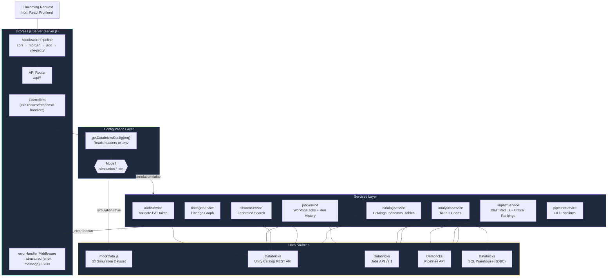
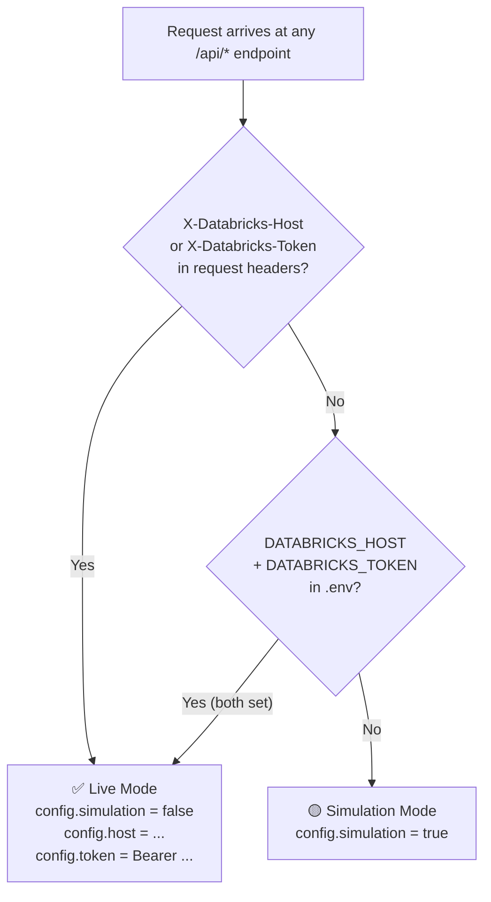

# 🖥️ DataAtlas — Backend API Server

> Express.js REST API server that proxies metadata requests to **Databricks Unity Catalog** in **Live Mode**, or serves realistic simulated data from `mockData.js` in **Simulation Mode**.

---

## 📐 Architecture



---

## 📁 Directory Structure

```
backend/
├── server.js              # App entry point: registers middleware, starts server
├── .env                   # Local secrets (gitignored — use .env.example as template)
├── .env.example           # Template for required environment variables
├── myenv                  # Alternative env file (gitignored)
│
├── config/
│   └── databricks.js      # getDatabricksConfig(req) — detects simulation vs live mode
│
├── routes/
│   └── api.js             # All /api/* route definitions registered here
│
├── controllers/           # Route handler functions (parse req, call service, send res)
│   └── (per domain)
│
├── middlewares/
│   └── error.js           # Global error handler → { error: true, message: '...' } JSON
│
└── services/              # Business logic — one file per domain
    ├── analyticsService.js   # Dashboard KPIs, storage growth, DBU usage charts
    ├── authService.js        # POST /api/auth/test — validate Databricks PAT
    ├── catalogService.js     # Catalogs, schemas, tables, columns, history, preview
    ├── impactService.js      # Blast radius analysis + critical dataset rankings
    ├── jobService.js         # Workflow job listing + run history
    ├── lineageService.js     # Upstream/downstream lineage graph construction
    ├── pipelineService.js    # DLT pipeline listing and detail
    ├── searchService.js      # Cross-domain federated search
    └── mockData.js           # Full simulation dataset (no Databricks required)
```

---

## ⚙️ Environment Configuration

Copy `.env.example` to `.env` and fill in your values:

```env
# Server
PORT=5000

# Databricks Connection (leave blank for Simulation Mode)
DATABRICKS_HOST=https://your-workspace.azuredatabricks.net
DATABRICKS_TOKEN=dapi...your-token...
DATABRICKS_SQL_HTTP_PATH=/sql/1.0/warehouses/your-warehouse-id
```

### Mode Detection Logic



---

## 🔌 API Endpoints

### Auth
| Method | Endpoint | Description |
|--------|----------|-------------|
| `POST` | `/api/auth/test` | Validates credentials and returns workspace metadata |

**Request body:**
```json
{
  "host": "https://your-workspace.azuredatabricks.net",
  "token": "dapi...",
  "warehousePath": "/sql/1.0/warehouses/..."
}
```

### Catalog
| Method | Endpoint | Description |
|--------|----------|-------------|
| `GET` | `/api/catalog/catalogs` | All Unity Catalog catalogs |
| `GET` | `/api/catalog/schemas?catalog={name}` | Schemas inside a catalog |
| `GET` | `/api/catalog/tables?catalog={name}&schema={name}` | Tables in a schema |
| `GET` | `/api/catalog/table/details?catalog=&schema=&table=` | Full table profile + columns |
| `GET` | `/api/catalog/table/history?catalog=&schema=&table=` | Delta Lake change history |
| `GET` | `/api/catalog/table/preview?catalog=&schema=&table=` | Sample data rows (SQL Warehouse) |
| `GET` | `/api/catalog/all-tables` | Flat list of all table names |
| `GET` | `/api/catalog/all-tables-metadata` | All tables with owner/schema metadata |

### Jobs & Pipelines
| Method | Endpoint | Description |
|--------|----------|-------------|
| `GET` | `/api/jobs` | All Databricks Workflow jobs |
| `GET` | `/api/jobs/:jobId` | Single job details + recent run history |
| `GET` | `/api/pipelines` | All Delta Live Table pipelines |
| `GET` | `/api/pipelines/:pipelineId` | Single pipeline details |

### Lineage & Impact
| Method | Endpoint | Description |
|--------|----------|-------------|
| `GET` | `/api/lineage?table={full.name}` | Lineage graph nodes + edges |
| `GET` | `/api/impact/critical` | Top critical datasets ranked by blast radius |
| `GET` | `/api/impact/analysis?table={full.name}` | Full impact analysis for one table |

### Analytics & Search
| Method | Endpoint | Description |
|--------|----------|-------------|
| `GET` | `/api/analytics/overview` | Dashboard KPIs + chart data |
| `GET` | `/api/search?q={term}` | Federated search across all asset types |

---

## 🔒 Mode Isolation — The Golden Rule

Every service method **must** follow this exact pattern. **Never break this.**

```js
static async getMyData(config) {
  // ✅ Simulation branch
  if (config.simulation) {
    return mockSomeData;
  }

  // ✅ Live branch — always throw, never fall back to mock
  try {
    const response = await axios.get(`${config.host}/api/...`, {
      headers: { Authorization: config.token }
    });
    return response.data;
  } catch (error) {
    throw new Error(`Databricks API Failed: ${error.message}`);
  }
}
```

**❌ Never do this:**
```js
} catch (error) {
  console.error(error);
  return mockData; // ← breaks mode isolation, silently hides errors
}
```

---

## 🧪 Running Locally

```bash
# Install dependencies
npm install

# Development (hot reload via nodemon)
npm run dev

# Production
npm start
```

---

## 📦 Dependencies

| Package | Version | Purpose |
|---------|---------|---------|
| `express` | ^4.19 | HTTP server framework |
| `axios` | ^1.6 | HTTP client for Databricks API calls |
| `cors` | ^2.8 | Cross-origin request headers |
| `dotenv` | ^16.4 | Environment variable loading |
| `morgan` | ^1.10 | HTTP request logger |
| `nodemon` | ^3.1 | Dev: auto-restart on file changes |

---

## 🤝 Contributing to the Backend

1. **Adding a new endpoint**: Add route in `routes/api.js`, controller in `controllers/`, and service method in `services/`
2. **Adding mock data**: Add to `mockData.js` with realistic but fake values
3. **Adding to live mode**: Always use `config.host`, `config.token`, `config.warehousePath` — never hardcode workspace URLs
4. **Error messages**: Must be descriptive: `"Databricks Catalog Fetch Failed: 401 Unauthorized"` not `"Error"`
