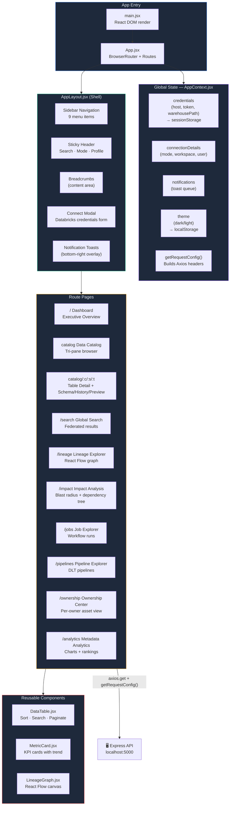
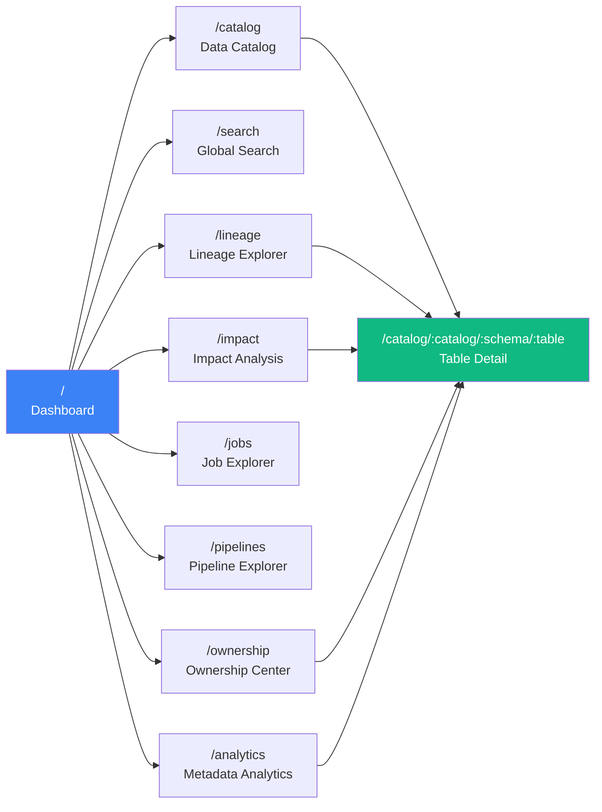
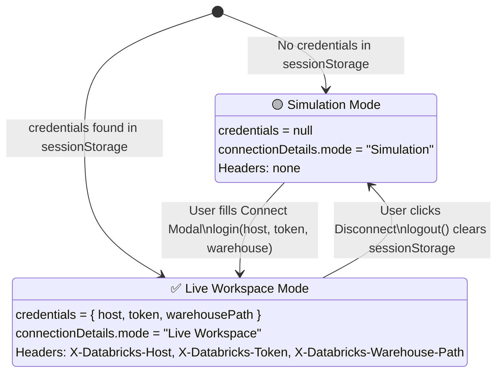

# ⚛️ DataAtlas — Frontend (React + Vite)

> The DataAtlas frontend is a **React 18** single-page application built with **Vite**. It provides a premium dark-mode UI for exploring Databricks Unity Catalog metadata, lineage, impact analysis, and workspace governance.

---

## 📐 Frontend Architecture



---

## 🧭 Page Routing Map



---

## 📁 Directory Structure

```
frontend/
├── index.html                 # HTML shell
├── vite.config.js             # Dev server + /api proxy to :5000
├── package.json
│
└── src/
    ├── main.jsx               # React.createRoot + render
    ├── App.jsx                # <Routes> — all page route declarations
    ├── index.css              # Design tokens, global reset, grid utilities
    │
    ├── context/
    │   └── AppContext.jsx     # createContext: credentials, theme, notifications
    │
    ├── layouts/
    │   └── AppLayout.jsx      # Shell: sidebar, sticky header, connection modal
    │
    ├── styles/
    │   └── AppLayout.module.css   # CSS Module for the layout shell
    │
    ├── components/
    │   ├── DataTable.jsx      # Reusable table: sort, search, paginate
    │   ├── MetricCard.jsx     # KPI card with value + trend indicator
    │   └── LineageGraph.jsx   # React Flow graph renderer for lineage
    │
    └── pages/
        ├── Login.jsx              # Startup screen (redirects to Dashboard)
        ├── Dashboard.jsx          # KPI cards + charts + audit feed
        ├── Catalog.jsx            # Three-pane catalog browser
        ├── TableDetail.jsx        # Table profile: schema, history, preview, stats
        ├── Search.jsx             # Federated search with filter facets
        ├── Lineage.jsx            # Lineage graph page with node details drawer
        ├── ImpactAnalysis.jsx     # Blast radius + direct/indirect downstream list
        ├── JobExplorer.jsx        # Job list + run history drawer
        ├── PipelineExplorer.jsx   # DLT pipeline list + detail drawer
        ├── OwnershipCenter.jsx    # Owner-grouped asset view
        └── MetadataAnalytics.jsx  # Charts: size distribution, schema growth, rankings
```

---

## 🔑 AppContext — Global State

`AppContext.jsx` is the **single source of truth** for credentials and UI state:



### Key API from `useApp()`

| Value | Type | Description |
|-------|------|-------------|
| `credentials` | `object\|null` | `{ host, token, warehousePath }` or null |
| `connectionDetails` | `object\|null` | `{ mode, workspace, user }` |
| `getRequestConfig()` | `function` | Returns Axios config with all 3 headers |
| `login(host, token, path)` | `async function` | Validates + stores credentials |
| `logout()` | `function` | Clears sessionStorage + resets state |
| `addNotification(msg, type)` | `function` | Shows toast (`success`/`error`/`info`/`warning`) |
| `theme` | `'dark'\|'light'` | Current UI theme |
| `toggleTheme()` | `function` | Toggles dark/light mode |

---

## 📡 Making API Calls — Pattern

**Always use this pattern** in every page/component:

```jsx
import axios from 'axios';
import { useApp } from '../context/AppContext';

const MyPage = () => {
  const { credentials, getRequestConfig, addNotification } = useApp();

  useEffect(() => {
    const fetchData = async () => {
      try {
        const res = await axios.get('/api/some-endpoint', getRequestConfig());
        setData(res.data);
      } catch (err) {
        const errMsg = err.response?.data?.message || err.message;
        addNotification(`Could not load data: ${errMsg}`, 'error');
        // Do NOT fall back to hardcoded data here
      }
    };
    fetchData();
  }, [credentials]); // Re-fetch when mode switches
};
```

**Rules:**
- ✅ Use `getRequestConfig()` — it adds all 3 Databricks headers automatically
- ✅ Include `credentials` in the `useEffect` dependency array so the page re-fetches when mode switches
- ✅ Show error with `addNotification` — never let errors silently disappear
- ❌ Never use `import.meta.env.VITE_DATABRICKS_*` for credentials — these are served by the backend
- ❌ Never fall back to hardcoded/mock data in the frontend

---

## 🎨 Design System

### CSS Variables (in `index.css`)

```css
/* Colors */
--color-bg           /* Page background */
--color-card         /* Card / panel background */
--color-card-hover   /* Card hover state */
--color-border       /* Borders and dividers */
--color-text         /* Primary text */
--color-text-muted   /* Secondary/hint text */

/* Accent Colors */
--color-blue         /* Primary actions */
--color-blue-light   /* Blue tinted backgrounds */
--color-emerald      /* Success / active states */
--color-rose         /* Error / danger states */
--color-amber        /* Warning / simulation states */
--color-violet       /* Jobs / workflow accent */

/* Typography */
--font-title         /* Display font (headings) */
--font-mono          /* Code / table names */

/* Layout */
--sidebar-width           /* 220px — expanded sidebar */
--sidebar-collapsed-width /* 64px — collapsed sidebar */
--header-height           /* 56px */
```

### Utility Classes

| Class | Usage |
|-------|-------|
| `.card` | Standard card container with border + padding |
| `.btn .btn-primary` | Primary action button |
| `.btn .btn-secondary` | Secondary/outline button |
| `.btn .btn-ghost` | Minimal text-only button |
| `.badge .badge-blue` | Status label (blue) |
| `.badge .badge-emerald` | Status label (green) |
| `.badge .badge-rose` | Status label (red) |
| `.badge .badge-amber` | Status label (yellow) |
| `.input` | Styled `<input>` field |
| `.catalog-grid` | Three-pane catalog layout |
| `.detail-grid` | Two-column detail layout |
| `.dashboard-grid` | Auto-fit KPI card grid |
| `.animate-fade` | Fade-in animation |
| `.animate-pulse` | Loading skeleton pulse |

---

## 🛠️ Running Locally

```bash
# Install
npm install

# Start dev server (Vite on :3000, proxies /api → :5000)
npm run dev

# Build for production
npm run build
```

### Vite Proxy Config (`vite.config.js`)

```js
server: {
  proxy: {
    '/api': {
      target: 'http://localhost:5000',
      changeOrigin: true
    }
  }
}
```

This means all `axios.get('/api/...')` calls from React are automatically forwarded to the Express backend. No CORS issues in development.

---

## 🤝 Contributing to the Frontend

### Adding a New Page

1. Create `src/pages/MyPage.jsx`
2. Add route in `src/App.jsx`:
   ```jsx
   <Route path="mypage" element={<MyPage />} />
   ```
3. Add sidebar link in `src/layouts/AppLayout.jsx` `menuItems` array
4. Follow the API call pattern above

### Component Guidelines

- Use `var(--color-*)` tokens — never raw hex colors
- Use `className="card"` for all panels
- Use `<DataTable>` for any tabular data — never build a raw `<table>` from scratch
- All loading states must use `className="animate-pulse"` skeleton divs
- All errors must use `addNotification(msg, 'error')` — never `alert()`

### Adding a New Chart

Use **Recharts** wrapped in `<ResponsiveContainer>`:

```jsx
import { ResponsiveContainer, AreaChart, Area, XAxis, YAxis, Tooltip } from 'recharts';

<ResponsiveContainer width="100%" height={300}>
  <AreaChart data={myData}>
    <XAxis dataKey="date" stroke="var(--color-text-muted)" />
    <YAxis stroke="var(--color-text-muted)" />
    <Tooltip contentStyle={{ backgroundColor: 'var(--color-card)', borderColor: 'var(--color-border)' }} />
    <Area dataKey="value" stroke="var(--color-blue)" fill="var(--color-blue-light)" />
  </AreaChart>
</ResponsiveContainer>
```

---

## 📦 Dependencies

| Package | Version | Purpose |
|---------|---------|---------|
| `react` | ^18 | UI framework |
| `react-dom` | ^18 | DOM rendering |
| `react-router-dom` | ^6 | Client-side routing |
| `axios` | ^1.6 | HTTP client |
| `recharts` | ^2 | Charts (area, bar, pie) |
| `reactflow` | ^11 | Lineage graph canvas |
| `lucide-react` | ^0.300 | Icon set |
| `vite` | ^5 | Build tool + dev server |
